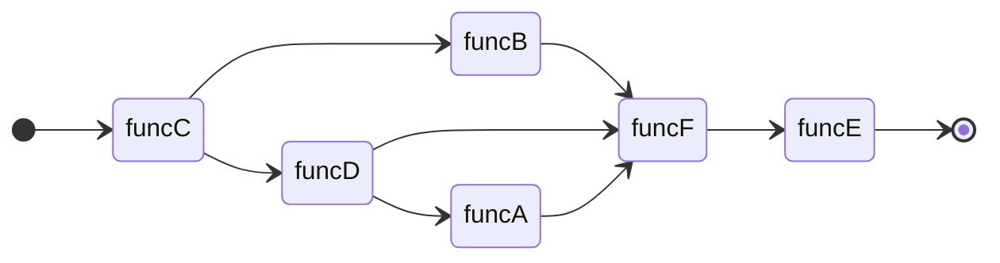

# DagStream

DagStream is the Python package in order to manage relationship between functions, especially for data-preprocessing functions for machine learning applications. It offers simple API like [taskflow](https://github.com/taskflow/taskflow).

## User manual

- https://ricos.lld.jp/machine_learning/dagstream

## Basic Concepts

### Definition of Dag

DagStream class convert your functions into dag nodes.

```python
import dagstream

def funcA():
    print("funcA")

def funcB():
    print("funcB")

def funcC():
    print("funcC")

def funcD():
    print("funcD")

def funcE():
    print("funcE")

def funcF():
    print("funcF")


stream = dagstream.DagStream()
A, B, C, D, E, F = stream.emplace(funcA, funcB, funcC, funcD, funcE, funcF)

A.precede(B, C)
E.succeed(B, C, D)
D.succeed(C)
F.succeed(E)

```

Relationship between functions are like below.


