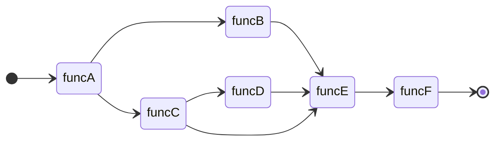

# DagStream

DagStream is the Python package in order to manage relationship between functions, especially for data-preprocessing functions for machine learning applications. It offers simple API similar to [taskflow](https://github.com/taskflow/taskflow).

For more details, please refer to docs below.

- [User Manual](https://ricosjp.github.io/dagstream/)

## How to install

You can intall dagstream by using pip.

```
pip install dagstream
```

## Basic Usage

### Definition of Dag

DagStream class convert your functions into dag nodes.

```python
import dagstream

def funcA():
    print("funcA")

def funcB():
    print("funcB")

def funcC():
    print("funcC")

def funcD():
    print("funcD")

def funcE():
    print("funcE")

def funcF():
    print("funcF")


stream = dagstream.DagStream()
A, B, C, D, E, F = stream.emplace(funcA, funcB, funcC, funcD, funcE, funcF)

A.precede(B, C)
E.succeed(B, C, D)
D.succeed(C)
F.succeed(E)

```

### Execute whole dag functions

dagstream execute the functions based on relationship you defined.

```python
from dagstream.executor import StreamExecutor

# construct functional dag
functional_dag = stream.construct()
executor = StreamExecutor(functional_dag)
executor.run()
```

In console, follwing items are shown.

```
funcA
funcC
funcB
funcD
funcE
funcF
```

### Draw relationship of functions using Mermaid

You can draw function dag relationship by using [Mermaid](https://mermaid.js.org/).

```python
from dagstream.viewers import MermaidDrawer

functional_dag = stream.construct()
drawer.output(functional_dag, "path/to/output.mmd")

```

The output is shown like below.


